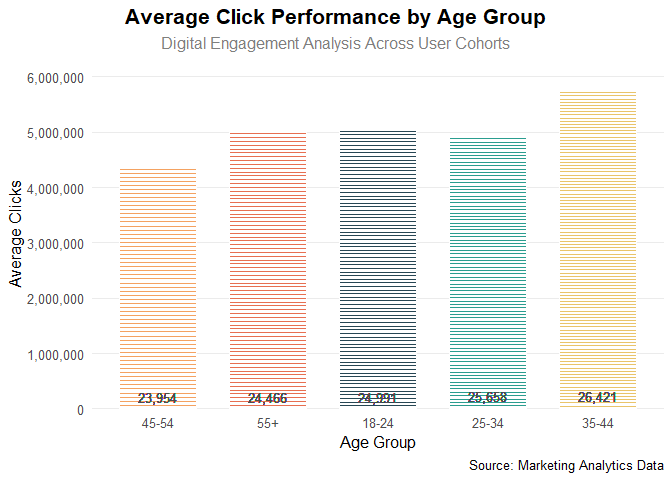
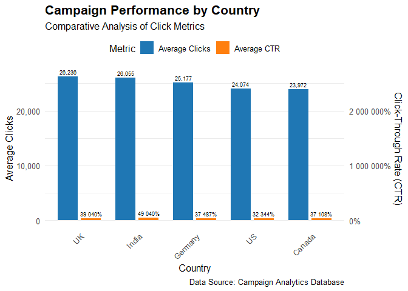

Advert Campaign Performance Analysis with R
================
Richard Ndah
2025-02-26

### **Analyzing Advertising Campaign Performance across Multiple Platforms and Uncovering Insights into Advertising Campaign Effectiveness with R. **

**Note**: Setting up my R environment

``` r
library(tidyverse)
```

    ## Warning: package 'purrr' was built under R version 4.4.2

    ## Warning: package 'lubridate' was built under R version 4.4.2

    ## ── Attaching core tidyverse packages ──────────────────────── tidyverse 2.0.0 ──
    ## ✔ dplyr     1.1.4     ✔ readr     2.1.5
    ## ✔ forcats   1.0.0     ✔ stringr   1.5.1
    ## ✔ ggplot2   3.5.1     ✔ tibble    3.2.1
    ## ✔ lubridate 1.9.4     ✔ tidyr     1.3.1
    ## ✔ purrr     1.0.4     
    ## ── Conflicts ────────────────────────────────────────── tidyverse_conflicts() ──
    ## ✖ dplyr::filter() masks stats::filter()
    ## ✖ dplyr::lag()    masks stats::lag()
    ## ℹ Use the conflicted package (<http://conflicted.r-lib.org/>) to force all conflicts to become errors

``` r
library(janitor)
```

    ## Warning: package 'janitor' was built under R version 4.4.2

    ## 
    ## Attaching package: 'janitor'
    ## 
    ## The following objects are masked from 'package:stats':
    ## 
    ##     chisq.test, fisher.test

``` r
library(skimr)

library(here)
```

    ## here() starts at C:/Users/richa/OneDrive/Dokumenty/ad_campaign_performance

``` r
library(scales)
```

    ## Warning: package 'scales' was built under R version 4.4.2

    ## 
    ## Attaching package: 'scales'
    ## 
    ## The following object is masked from 'package:purrr':
    ## 
    ##     discard
    ## 
    ## The following object is masked from 'package:readr':
    ## 
    ##     col_factor

``` r
library(dplyr)
```

**Loading csv file and getting to know its content for further
analysis**

``` r
advert_campaign_perfomance <- read.csv("ad_campaign_performance.csv")


head(advert_campaign_perfomance)
```

    ##   Campaign_ID Budget Duration  Platform Content_Type Target_Age Target_Gender
    ## 1 CAMP-XAJI0Y  15895       39 Instagram        Video      35-44        Female
    ## 2 CAMP-6DPBHS    960        8  LinkedIn        Video      45-54        Female
    ## 3 CAMP-AHXTHV  38258       54   YouTube        Image      35-44           All
    ## 4 CAMP-3A3ZMF  44832       28  Facebook         Text      25-34        Female
    ## 5 CAMP-8MDD4V  11384       36    Google        Story      18-24           All
    ## 6 CAMP-30T9NT   6365       58  LinkedIn        Image      45-54          Male
    ##   Region Clicks Conversions        CTR        CPC Conversion_Rate Success
    ## 1     US  48297        2116  303.85027 0.32910947        4.381225       1
    ## 2     UK  15097        2340 1572.60417 0.06358879       15.499768       1
    ## 3     US   8134        2740   21.26091 4.70346693       33.685763       1
    ## 4     US  21801        4277   48.62821 2.05641943       19.618366       1
    ## 5     UK  16503        1488  144.96662 0.68981397        9.016542       1
    ## 6     UK  20358        1558  319.84289 0.31265350        7.653011       1

``` r
glimpse(advert_campaign_perfomance)
```

    ## Rows: 1,000
    ## Columns: 14
    ## $ Campaign_ID     <chr> "CAMP-XAJI0Y", "CAMP-6DPBHS", "CAMP-AHXTHV", "CAMP-3A3…
    ## $ Budget          <int> 15895, 960, 38258, 44832, 11384, 6365, 16950, 37294, 2…
    ## $ Duration        <int> 39, 8, 54, 28, 36, 58, 47, 8, 39, 59, 35, 55, 24, 23, …
    ## $ Platform        <chr> "Instagram", "LinkedIn", "YouTube", "Facebook", "Googl…
    ## $ Content_Type    <chr> "Video", "Video", "Image", "Text", "Story", "Image", "…
    ## $ Target_Age      <chr> "35-44", "45-54", "35-44", "25-34", "18-24", "45-54", …
    ## $ Target_Gender   <chr> "Female", "Female", "All", "Female", "All", "Male", "M…
    ## $ Region          <chr> "US", "UK", "US", "US", "UK", "UK", "US", "Germany", "…
    ## $ Clicks          <int> 48297, 15097, 8134, 21801, 16503, 20358, 39018, 30127,…
    ## $ Conversions     <int> 2116, 2340, 2740, 4277, 1488, 1558, 2114, 1045, 2432, …
    ## $ CTR             <dbl> 303.85027, 1572.60417, 21.26091, 48.62821, 144.96662, …
    ## $ CPC             <dbl> 0.32910947, 0.06358879, 4.70346693, 2.05641943, 0.6898…
    ## $ Conversion_Rate <dbl> 4.3812245, 15.4997682, 33.6857635, 19.6183661, 9.01654…
    ## $ Success         <int> 1, 1, 1, 1, 1, 1, 1, 1, 1, 1, 1, 1, 1, 1, 1, 1, 0, 1, …

``` r
colnames(advert_campaign_perfomance)
```

    ##  [1] "Campaign_ID"     "Budget"          "Duration"        "Platform"       
    ##  [5] "Content_Type"    "Target_Age"      "Target_Gender"   "Region"         
    ##  [9] "Clicks"          "Conversions"     "CTR"             "CPC"            
    ## [13] "Conversion_Rate" "Success"

#### **Summary:**

**Now lets have a look at the summary for potential insights**

``` r
summary(advert_campaign_perfomance)
```

    ##  Campaign_ID            Budget         Duration       Platform        
    ##  Length:1000        Min.   :  109   Min.   : 3.00   Length:1000       
    ##  Class :character   1st Qu.:11480   1st Qu.:17.00   Class :character  
    ##  Mode  :character   Median :23965   Median :32.00   Mode  :character  
    ##                     Mean   :24592   Mean   :31.69                     
    ##                     3rd Qu.:37954   3rd Qu.:46.00                     
    ##                     Max.   :49950   Max.   :60.00                     
    ##  Content_Type        Target_Age        Target_Gender         Region         
    ##  Length:1000        Length:1000        Length:1000        Length:1000       
    ##  Class :character   Class :character   Class :character   Class :character  
    ##  Mode  :character   Mode  :character   Mode  :character   Mode  :character  
    ##                                                                             
    ##                                                                             
    ##                                                                             
    ##      Clicks       Conversions        CTR                CPC          
    ##  Min.   :   98   Min.   :  13   Min.   :    0.23   Min.   :  0.0032  
    ##  1st Qu.:13225   1st Qu.:1223   1st Qu.:   52.64   1st Qu.:  0.4682  
    ##  Median :25014   Median :2407   Median :  102.21   Median :  0.9784  
    ##  Mean   :25131   Mean   :2480   Mean   :  388.99   Mean   :  2.9690  
    ##  3rd Qu.:37387   3rd Qu.:3771   3rd Qu.:  213.59   3rd Qu.:  1.8999  
    ##  Max.   :49820   Max.   :4995   Max.   :31711.61   Max.   :430.3707  
    ##  Conversion_Rate        Success     
    ##  Min.   :   0.0362   Min.   :0.000  
    ##  1st Qu.:   4.8897   1st Qu.:1.000  
    ##  Median :   9.8477   Median :1.000  
    ##  Mean   :  26.8570   Mean   :0.897  
    ##  3rd Qu.:  18.7577   3rd Qu.:1.000  
    ##  Max.   :1554.1219   Max.   :1.000

#### **Platform Success:**

**From the summary above it is clear that there’s a lot to uncover from
this data set even though its small. First we will be looking at
platforms with the highest success rates **

``` r
advert_platforms_data <- advert_campaign_perfomance %>%
  group_by(Platform) %>%
  summarize(
    total_clicks = sum(Clicks),
    total_conversions = sum(Conversions),
    success_rate = (total_conversions / total_clicks) * 100
  ) %>% 
  arrange(desc(success_rate))

print(advert_platforms_data)
```

    ## # A tibble: 5 × 4
    ##   Platform  total_clicks total_conversions success_rate
    ##   <chr>            <int>             <int>        <dbl>
    ## 1 LinkedIn       5005258            545340        10.9 
    ## 2 Facebook       4764998            468688         9.84
    ## 3 Google         4480361            430306         9.60
    ## 4 YouTube        5940228            565980         9.53
    ## 5 Instagram      4940082            470046         9.51

#### **Top 10 adverts:**

**LinkedIn seems to be the best performing platform due to success rate
from clicks and conversions followed by Facebook and Google. Now lets
take a look at the top 10 most successful adverts next**

``` r
advert_ctr_data <- advert_campaign_perfomance %>%
  group_by(Platform) %>%
  reframe(
    campaign_id = (Campaign_ID), 
    ad_content = (Content_Type),
    duration = (Duration),      
    total_clicks = sum(Clicks),
    total_conversions = sum(Conversions),
    success_rate = (total_conversions / total_clicks) * 100,
    success = (Success)
  ) %>%
  arrange((duration),desc(success_rate)) %>% 
  head(10)

print(advert_ctr_data)
```

    ## # A tibble: 10 × 8
    ##    Platform campaign_id ad_content duration total_clicks total_conversions
    ##    <chr>    <chr>       <chr>         <int>        <int>             <int>
    ##  1 LinkedIn CAMP-R1DWWO Story             3      5005258            545340
    ##  2 LinkedIn CAMP-YME6RP Carousel          3      5005258            545340
    ##  3 LinkedIn CAMP-MXLVZ4 Carousel          3      5005258            545340
    ##  4 Facebook CAMP-OWGZRI Video             3      4764998            468688
    ##  5 Facebook CAMP-43D8W3 Video             3      4764998            468688
    ##  6 Google   CAMP-0ODWMQ Video             3      4480361            430306
    ##  7 YouTube  CAMP-D84U89 Text              3      5940228            565980
    ##  8 YouTube  CAMP-9V20YA Carousel          3      5940228            565980
    ##  9 YouTube  CAMP-9TRFLQ Image             3      5940228            565980
    ## 10 YouTube  CAMP-0KZ4Z7 Text              3      5940228            565980
    ## # ℹ 2 more variables: success_rate <dbl>, success <int>

#### **Most successful advert campaigns and content type:**

**The table above gives information about the most successful adverts
that recorded the best engagements in the shortest span period of 3 days
now lets take look at the visualization that further explains more on
this finding **

``` r
ggplot(advert_ctr_data, aes(x = campaign_id, y = success_rate, fill = Platform)) +
  geom_col() +
  # Add labels for ad_content
  geom_text(
    aes(label = ad_content),
    position = position_stack(vjust = 0.5),  # Center labels in stacked bars
    size = 3,  # Adjust font size
    color = "white"  # Optional: Improve readability
  ) +
  labs(
    title = "Top-Performing Campaigns by Platform and Type:", subtitle = "Campaign Success Rates Across Platforms and Ad Formats (3-Day Period)",
    x = "Campaign Id",
    y = "Success Rate (%)"
  ) +
  theme_minimal() +
  theme(
    axis.text.x = element_text(angle = 45, hjust = 1, size = 8),
    legend.position = "bottom"
  )
```

<!-- -->

#### **Content Type Distribution:**

**To have a clearer knowledge we need to look deeper into the content
type that drives more engagements. **

``` r
advert_content_data <- advert_campaign_perfomance %>%
  group_by(content = Content_Type) %>%
  summarise(avg_total_clicks = mean(Clicks)) %>%
  mutate(
    sum_total_clicks = sum(avg_total_clicks),
    percentage = (avg_total_clicks / sum_total_clicks) * 100
  )

print(advert_content_data)
```

    ## # A tibble: 5 × 4
    ##   content  avg_total_clicks sum_total_clicks percentage
    ##   <chr>               <dbl>            <dbl>      <dbl>
    ## 1 Carousel           26781.          125718.       21.3
    ## 2 Image              25005.          125718.       19.9
    ## 3 Story              24542.          125718.       19.5
    ## 4 Text               23976.          125718.       19.1
    ## 5 Video              25414.          125718.       20.2

``` r
ggplot(advert_content_data, aes(x = "", y = percentage, fill = content)) +
   geom_bar(stat = "identity", width = 1, color = "white") +
   coord_polar("y", start = 0) +
   geom_text(aes(label = paste0(round(percentage, 1), "%")), 
             position = position_stack(vjust = 0.5),
             size = 5, color = "black", fontface = "bold") +
   scale_fill_manual(values = c("#80ff00", "#00ffff", "#ffe6e6", "#ff4d4d", "orange")) +
   labs(title = "Content Type Distribution",
        subtitle = "Percentage breakdown of different content types") +
   theme_void() +
   theme(plot.title = element_text(hjust = 0.5, size = 20, face = "bold"),
         plot.subtitle = element_text(hjust = 0.5, size = 14, margin = margin(b = 20)),
         legend.position = "right",
         legend.title = element_text(size = 12, face = "bold"),
         legend.text = element_text(size = 11),
         plot.margin = unit(c(1, 1, 1, 1), "cm")) +
   guides(fill = guide_legend(title = "Content Types"))
```

<!-- -->

#### **Average click performance by age groups:**

**Now we also need to look at engagements by age groups **

``` r
ad_cam_pef_viz <- advert_campaign_perfomance %>%
  group_by(age_group = Target_Age) %>%
  reframe(
    country = (Region),
    avg_clicks = mean(Clicks))


ggplot(data = ad_cam_pef_viz,  
       aes(x = reorder(age_group, avg_clicks), 
           y = avg_clicks, 
           fill = age_group)) +
  geom_col(width = 0.7, color = "white", linewidth = 0.5) +
  geom_text(aes(label = scales::comma(avg_clicks, accuracy = 1)),
            vjust = -0.5, 
            size = 3.5,
            color = "gray30") +
  scale_fill_manual(values = c("#264653", "#2A9D8F", "#E9C46A", "#F4A261", "#E76F51")) +
  scale_y_continuous(
    labels = scales::comma_format(accuracy = 1),  # Force whole numbers with commas
    expand = expansion(mult = c(0, 0.1)),
    breaks = scales::pretty_breaks(n = 6)  # Clean integer breaks
  ) +
  labs(
    title = "Average Click Performance by Age Group",
    subtitle = "Digital Engagement Analysis Across User Cohorts",
    x = "Age Group",
    y = "Average Clicks",
    caption = "Source: Marketing Analytics Data"
  ) +
  theme_minimal(base_size = 12) +
  theme(
    legend.position = "none",
    plot.title = element_text(face = "bold", size = 16, hjust = 0.5),
    plot.subtitle = element_text(hjust = 0.5, color = "gray50"),
    axis.text.y = element_text(color = "gray30"),
    panel.grid.major.x = element_blank(),
    panel.grid.minor.y = element_blank(),
    plot.title.position = "plot"
  )
```

<!-- -->

``` r
advert_country_summary <- advert_campaign_perfomance %>%
            group_by(country = Region) %>%
            summarize(
              total_clicks = sum(Clicks),
              total_conversions = sum(Conversions),
              success_rate = (total_conversions / total_clicks) * 100,
              # Assuming success summary is based on a 50% success rate threshold
              success_summary = success_rate >= 10
            )      
print(advert_country_summary)
```

    ## # A tibble: 5 × 5
    ##   country total_clicks total_conversions success_rate success_summary
    ##   <chr>          <int>             <int>        <dbl> <lgl>          
    ## 1 Canada       4458870            483470        10.8  TRUE           
    ## 2 Germany      4959943            497486        10.0  TRUE           
    ## 3 India        4924341            456436         9.27 FALSE          
    ## 4 UK           5876757            563304         9.59 FALSE          
    ## 5 US           4911016            479664         9.77 FALSE

#### **Country Perfomance:**

**Next we are going to look into how countries have been engaged and
their performance so far **

``` r
ggplot(advert_country_summary, 
                 aes(x = reorder(country, total_clicks), 
                     y = total_clicks,
                     fill = success_summary)) +
            geom_bar(stat = "identity") +
            geom_line(aes(y = success_rate * max(total_clicks)/100, 
                          group = 1),
                      color = "navy",
                      linewidth = 1) +
            geom_text(aes(y = success_rate * max(total_clicks)/100, 
                          label = paste0(round(success_rate, 1), "%")),
                      vjust = -0.5,
                      color = "black") +
            scale_y_continuous(
              name = "Total Clicks",
              labels = scales::comma,  # Format with commas instead of scientific notation
              sec.axis = sec_axis(~. * 100 / max(advert_country_summary$total_clicks),
                                  name = "Success Rate (%)")
            ) +
            scale_fill_manual(values = c("FALSE" = "#FF6B6B", "TRUE" = "#4ECDC4")) +
            labs(
              title = "Country Performance: Total Clicks and Success Rate",
              x = "Country",
              fill = "Met Success Criteria"
            ) +
            theme_minimal() +
            theme(
              axis.text.x = element_text(angle = 45, hjust = 1),
              legend.position = "bottom"
            )
```

<!-- -->

#### **Gender Engagements by Country:**

``` r
ggplot(data = advert_campaign_perfomance) +
            geom_bar(mapping = aes(x = Target_Gender, fill = Target_Gender))+
            labs(title = "Gender Engagements by Country")+
            facet_wrap(~Region) +
  
  # Customize bar colors
  scale_fill_manual(
    name = "Gender",  # Legend title
    values = c("All" = "#c2a100", "Male" = "#1f77b4", "Female" = "#5d8c4e")  # Assign colors
    # Replace "Male"/"Female" with your actual categories (case-sensitive)
    # Replace hex codes with your desired colors
  )
```

<!-- -->

#### **Clicks:**

``` r
advert_click_rate_data <- advert_campaign_perfomance %>%
  group_by(country = Region) %>% 
  reframe(
    avg_clicks  = mean(Clicks),
    avg_ctr = mean(CTR)
  )


ggplot(advert_click_rate_data, aes(x = avg_clicks, y = avg_ctr, color = country)) +
                                 geom_point(size = 3) +  # Scatter plot with points
                                 geom_smooth(method = "lm", se = FALSE) +  # Add a trend line
                                 labs(
                                   title = "Average Clicks vs. Average CTR by Region",
                                   x = "Average Clicks",
                                   y = "Average CTR",
                                   color = "Region"  # Legend title
                                 ) +
                                 theme_minimal() +  # Clean theme
                                 theme(
                                   plot.title = element_text(face = "bold", size = 16),  
                                   axis.title = element_text(face = "bold", size = 12),  
                                   legend.position = "bottom"  # Place legend at the bottom
                                 )
```

    ## `geom_smooth()` using formula = 'y ~ x'

<!-- -->

### **Campaign Performance by Country:**

``` r
plot_data <- advert_click_rate_data %>%
  pivot_longer(cols = c(avg_clicks, avg_ctr), 
               names_to = "metric", 
               values_to = "value")

# Then create the plot
ggplot(plot_data, aes(x = reorder(country, -value), y = value, fill = metric)) +
  geom_col(position = position_dodge(width = 0.8), width = 0.7) +
  scale_fill_manual(
    values = c("avg_clicks" = "#1f77b4", "avg_ctr" = "#ff7f0e"),
    labels = c("Average Clicks", "Average CTR")
  ) +
  scale_y_continuous(
    labels = scales::comma_format(),
    sec.axis = sec_axis(~., 
                       labels = scales::percent_format(accuracy = 1),
                       name = "Click-Through Rate (CTR)")
  ) +
  theme_minimal(base_size = 12) +
  theme(
    axis.text.x = element_text(angle = 45, hjust = 1, size = 10),
    panel.grid.major.x = element_blank(),
    legend.position = "top",
    plot.title = element_text(face = "bold", size = 16),
    axis.title = element_text(size = 12)
  ) +
  labs(
    title = "Campaign Performance by Country",
    subtitle = "Comparative Analysis of Click Metrics",
    x = "Country",
    y = "Average Clicks",
    fill = "Metric",
    caption = "Data Source: Campaign Analytics Database"
  ) +
  geom_text(
    aes(label = ifelse(metric == "avg_ctr",
                     scales::percent(value, accuracy = 1),
                     scales::comma(value, accuracy = 1))),
    position = position_dodge(width = 0.8),
    vjust = -0.5,
    size = 2.4
  )  
```

<!-- -->

#### **Campaign Performance Distribution:**

``` r
campaign_type_group <- advert_campaign_perfomance %>%
            mutate(
              campaign_type = factor(
                case_when(
                  CPC <= mean(CPC) & Clicks >= mean(Clicks) & Success == 1 & Budget < mean(Budget) & Duration <= 10 ~ "Good",
                  CPC > mean(CPC) & Clicks < mean(Clicks) & Success == 0 & Budget > mean(Budget) & Duration > 20 ~ "Bad",
                  TRUE ~ "Moderate"  # Catch-all for remaining cases
                ),
                levels = c("Good", "Bad", "Moderate")  
              )
            ) %>%
            select(Campaign_ID, Budget, Clicks, CPC, Success, Duration, campaign_type) %>%
            drop_na()

campaign_summary <- campaign_type_group %>%
  count(campaign_type) %>%
  mutate(pct = n / sum(n),
         label = paste0(round(pct * 100, 1), "%"))

# Create visualization
campaign_vis <- ggplot(campaign_summary, 
                       aes(x = campaign_type, y = pct, fill = campaign_type)) +
  geom_col(width = 0.7, show.legend = FALSE) +
  geom_text(aes(label = label), 
            vjust = -0.5, 
            size = 5,
            color = "navy",
            fontface = "bold") +
  scale_y_continuous(labels = percent_format(accuracy = 1),
                     limits = c(0, max(campaign_summary$pct) * 1.1),
                     expand = c(0, 0)) +
  scale_fill_manual(values = c("Good" = "#4E79A7", 
                              "Bad" = "#E15759", 
                              "Moderate" = "#F28E2B")) +
  labs(title = "Campaign Performance Distribution",
       subtitle = "Classification Based on CPC, Clicks, Budget, and Success Metrics",
       caption = "Data Source: Marketing Analytics Platform\nClassification Criteria: Relative to Platform Averages",
       x = NULL, y = "Percentage of Total Campaigns") +
  theme_minimal(base_size = 14) +
  theme(
    plot.title = element_text(face = "bold", hjust = 0.5, size = 20),
    plot.subtitle = element_text(hjust = 0.5, color = "gray40", margin = margin(b = 20)),
    plot.caption = element_text(color = "gray50", hjust = 0),
    panel.grid.major.x = element_blank(),
    axis.text.x = element_text(face = "bold", size = 12),
    axis.text.y = element_blank(),
    plot.margin = margin(20, 40, 20, 40)
  )

print(campaign_vis)
```

<!-- -->

### **Findings:**

**Key Findings from Advertising Campaign Performance Analysis**

**T**his analysis explored advertising campaign performance across
various platforms and content types, focusing on key metrics such as
clicks, conversions, and success rates. Here are some notable findings:

1.  LinkedIn’s Effectiveness: LinkedIn demonstrated strong potential as
    an advertising platform, achieving high conversion rates within a
    short three-day period. This suggests that LinkedIn ads can be
    particularly effective for reaching and engaging target audiences.

2.  Carousel Content’s Rising Popularity: Surprisingly, carousel content
    emerged as a top performer, surpassing even video content in
    engagement. This indicates that carousels are an increasingly
    effective format for capturing audience attention and driving ad
    interactions.

3.  Age and Engagement: The 35-44 age group exhibited the highest
    engagement levels, suggesting that this demographic may be more
    receptive to advertising messages, potentially due to increased
    responsibilities and life stage considerations.

4.  Gender and Geographic Trends: Female audiences showed higher
    engagement across most regions, with particularly strong performance
    in Germany and Canada. This highlights the importance of considering
    gender when tailoring ad content and targeting strategies.

Note: This analysis was conducted on a specific dataset for training
purposes. The findings should be interpreted within this context and may
not directly reflect real-time advertising performance.

Feedback Welcome:

We appreciate your interest in this analysis. Please feel free to leave
your feedback or suggestions in the comments section below. Your
insights are valuable for improving future analyses.

Thank you for your time!
